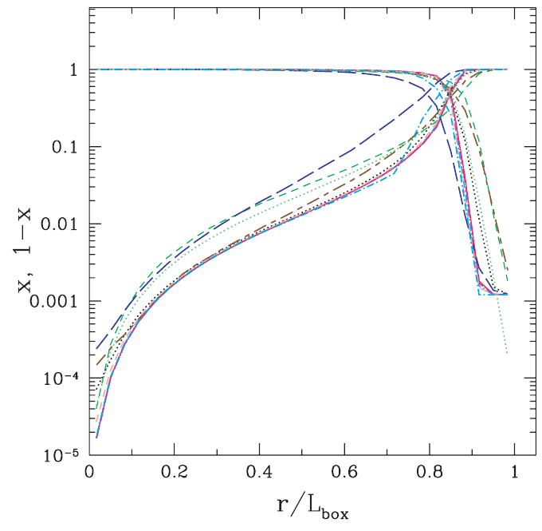
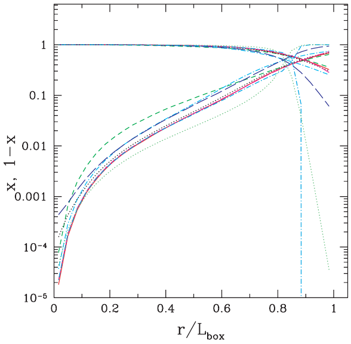
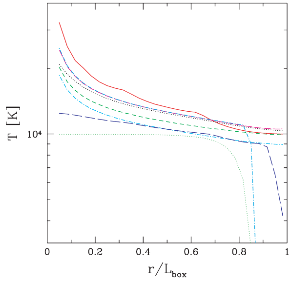
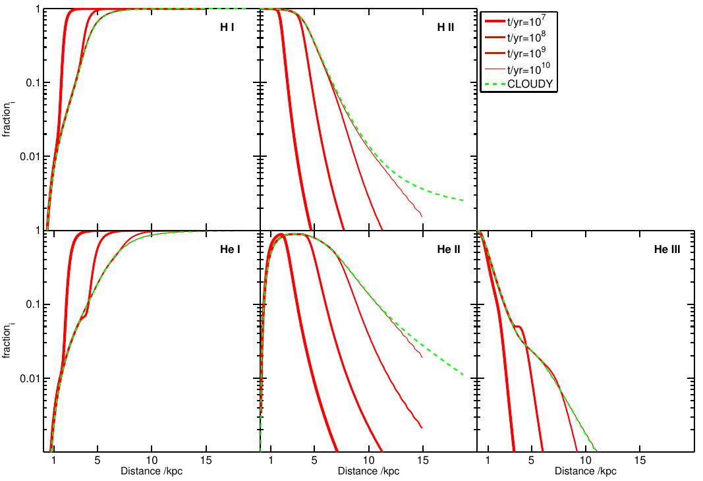
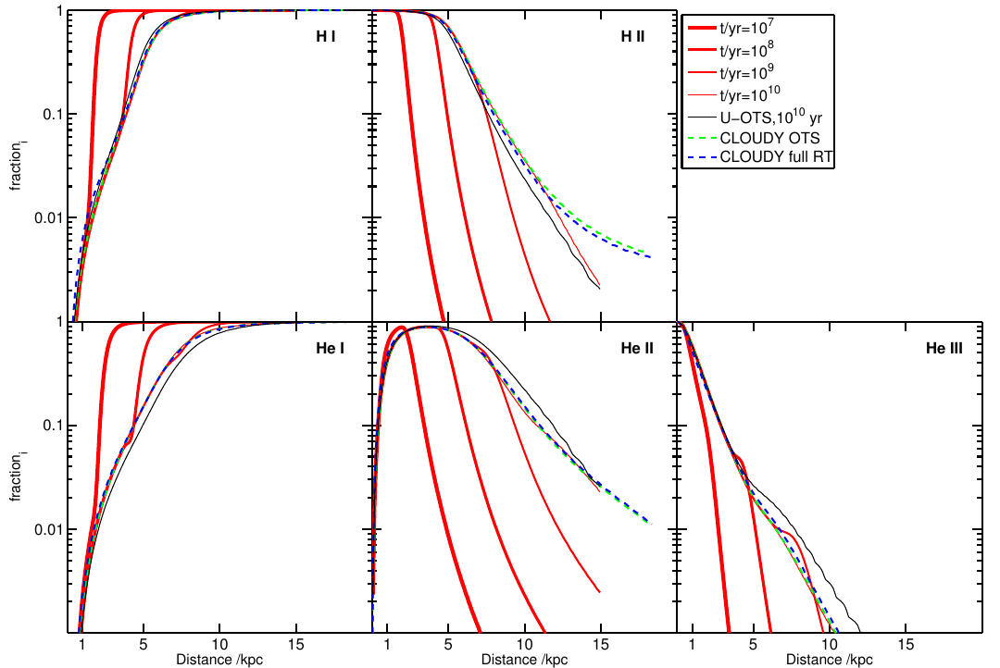
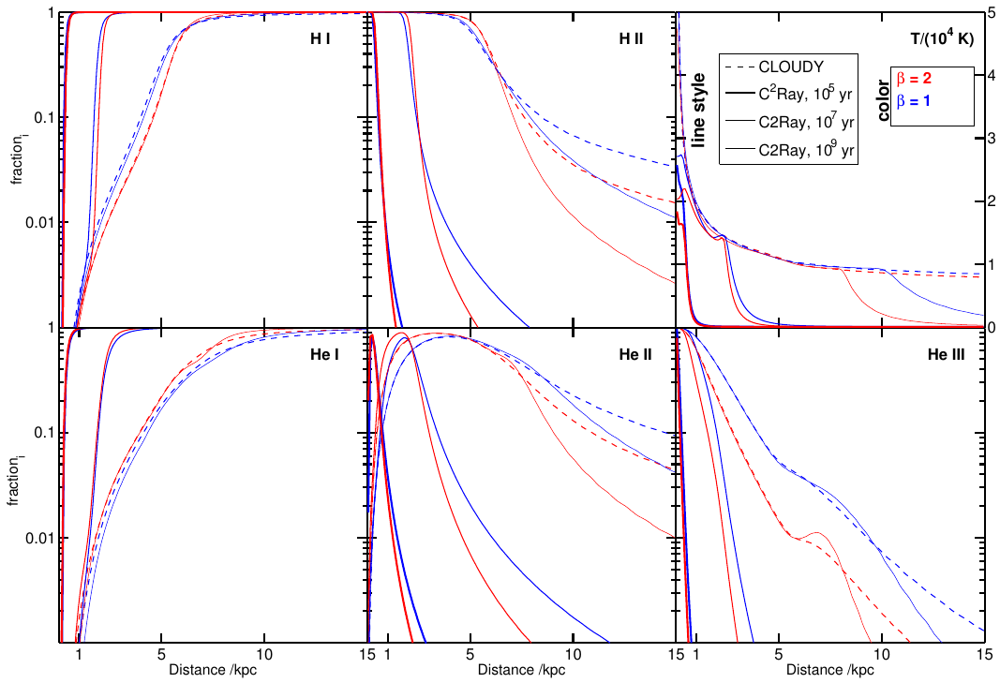
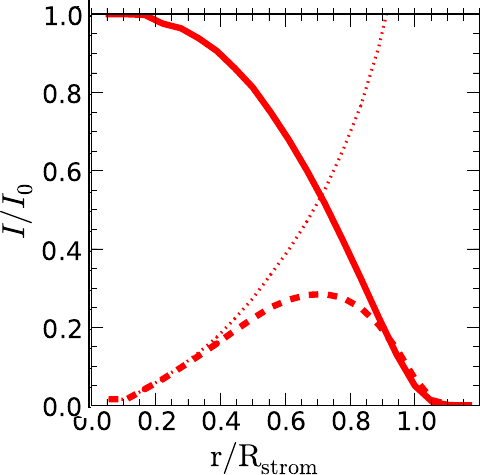

===========================
Stromgren Sphere Examples
===========================

In this section we will go thourgh some concrete examples using 
:class:`~rabacus.f2py.sphere_stromgren.SphereStromgren`.  
This class models a spherically symmetric gas distribution with a point source 
at the center. In particular we will examine Tests 1 and 2 in the Cosmological 
Radiative Transfer Comparison Project (CRTCP) [Iliev06]_, the work of 
[Friedrich12]_ which includes helium, and the work of [Raicevic14]_ which 
includes radiative transfer of recombination radiation. 

Preparation
=================

Import Packages
-------------------

The following examples require three python packages to be imported, ::

  import numpy as np
  import pylab as plt
  import rabacus as ra

Plotting Functions
-------------------

We will be making several plots during the course of these examples. In 
order to facilitate this, we will define a few convenience functions 
here, :: 

  def plot_sphere_x( s, fname, style, plot_H=True, plot_He=True ):
    """ put plot of ionization fractions from sphere `s` into fname """ 

    plt.figure( figsize=(7,7) )

    s.r_c.units = 'kpc'
    s.Edges.units = 'kpc'
    if style == 'I':
        xx = s.r_c / s.Edges[-1]
    else:
        xx = s.r_c

    if plot_He:
        plt.plot( xx, np.log10( s.xHe1 ), 
                  color='green', ls='-', label = r'$x_{\rm HeI}$' )
        plt.plot( xx, np.log10( s.xHe2 ), 
                  color='green', ls='--', label = r'$x_{\rm HeII}$' )
        plt.plot( xx, np.log10( s.xHe3 ), 
                  color='green', ls=':', label = r'$x_{\rm HeIII}$' )

    if plot_H:
        plt.plot( xx, np.log10( s.xH1 ), 
                  color='red', ls='-', label = r'$x_{\rm HI}$' )
        plt.plot( xx, np.log10( s.xH2 ), 
                  color='red', ls='--', label = r'$x_{\rm HII}$' )

    if style == 'I':
        plt.xlim( -0.05, 1.05 )
        plt.xlabel( 'r_c / Rsphere' )
    else:
        plt.xlim( -0.50, 15.2 )
        plt.xlabel( 'r_c [kpc]' )

    if style == 'I':    
        plt.ylim( -6.0, 0.5 )
    else:
        plt.ylim( -3.1, 0.1 )
    plt.ylabel( 'log 10 ( x )' )

    plt.grid()
    plt.legend(loc='lower center', ncol=2)
    plt.tight_layout()
    plt.savefig( 'doc/img/x' + fname )

  def plot_sphere_T( s, fname, style ):
    """ put plot of temperature from sphere `s` into fname """ 

    plt.figure( figsize=(7,7) )

    s.r_c.units = 'kpc'
    s.Edges.units = 'kpc'
    if style == 'I':
        xx = s.r_c / s.Edges[-1]
    else:
        xx = s.r_c

    plt.plot( xx, s.T, 
              color='black', ls='-', label = r'$T$' )

    if style == 'I':
        plt.xlim( -0.05, 1.05 )
        plt.xlabel( 'r_c / Rsphere' )
    else:
        plt.xlim( -0.50, 15.2 )
        plt.xlabel( 'r_c [kpc]' )

    plt.ylim( 0.0, 5.0e4 )
    plt.ylabel( 'T [K]' )

    plt.grid()
    plt.legend(loc='best')
    plt.tight_layout()
    plt.savefig( 'doc/img/T_' + fname )

Create Sources
-------------------

Next we will setup three point sources, one monochromatic, one with a 
thermal spectrum, and one with a powerlaw spectrum. 
We will normalize all spectra such that they emit the same number of photons 
per second, :: 

  Ln = 5.0e48 / ra.u.s  # set photon luminosity

  q_mono = 1.0
  q_min = q_mono
  q_max = q_mono
  src_mono = ra.PointSource( q_min, q_max, 'monochromatic' )
  src_mono.normalize_Ln( Ln )

  q_min = 1.0
  q_max = 10.0
  T_eff = 1.0e5 * ra.u.K
  src_thrm = ra.PointSource( q_min, q_max, 'thermal', T_eff=T_eff )
  src_thrm.normalize_Ln( Ln )

  q_min = 1.0
  q_max = 10.0
  alpha = -1.0
  src_pwr1 = ra.PointSource( q_min, q_max, 'powerlaw', alpha=alpha )
  src_pwr1.normalize_Ln( Ln )

Solution Container
-------------------

We also initialize a dictionary to hold our results, :: 

  spheres = {}

Iliev06 Examples
=======================

Setup
-----------

To begin, we define a sphere as descibed in [Iliev06]_.  Note that we 
take the helium density from [Friedrich12]_ and also define a null helium
densiy which is much lower in order to approximate a zero helium 
environment. ::

  Nl = 512
  T = np.ones(Nl) * 1.0e4 * ra.u.K

  Rsphere = 6.6 * ra.u.kpc
  Edges = np.linspace( 0.0 * ra.u.kpc, Rsphere, Nl+1 )
  nH = np.ones(Nl) * 1.0e-3 / ra.u.cm**3
  nHe = np.ones(Nl) * 8.7e-5 / ra.u.cm**3
  nHe_null = np.ones(Nl) * 1.0e-15 / ra.u.cm**3

Optically Thin
------------------

We begin with a very basic scenario, a pure hydrogen sphere with constant
density and temperature.  We place a monochromatic source at the center 
but allow only geometric dillution of the radiation by setting the keyword
`thin` to ``True``.  By default, case A recombination rates are used.  We use 
case B recombination rates by setting the keyword `fixed_fcA` to ``0.0``. ::

  key = 'thin_caseB_mono_fixT'

  spheres[key] = ra.SphereStromgren( 
      Edges, T, nH, nHe_null, src_mono, fixed_fcA=0.0, thin=True )

  plot_sphere_x( 
      spheres[key], 'strm_sphere_' + key + '.png', 'I', plot_He=False )

.. figure:: ./img/x_strm_sphere_thin_caseB_mono_fixT.png
   :width: 500px
   :align: center
   :figclass: align-center

   Stromgren Sphere - Thin - Case B - Mono - Fixed T

In this case, the gas remains ionized at all radii.   

Test 1 
--------------------------------------

Test 1 of [Iliev06]_ also involves a pure hydrogen sphere with constant
density and temperature and a central monochromatic source.  We call the 
solver with the same input except this time we leave out the keyword `thin`
so the radiation will be attenuated by the gas.  The resulting figure can be 
compared directly to the right panel of Fig. 8 in [Iliev06]_ 
(reproduced below). ::  

  key = 'rt_caseB_mono_fixT'

  spheres[key] = ra.SphereStromgren( 
      Edges, T, nH, nHe_null, src_mono, fixed_fcA=0.0 )

  plot_sphere_x( 
      spheres[key], 'strm_sphere_' + key + '.png', 'I', plot_He=False )

.. figure:: ./img/x_strm_sphere_rt_caseB_mono_fixT.png
   :width: 500px
   :align: center

   Stromgren Sphere - RT - Case B - Mono - Fixed T

   [Iliev06]_ - Fig. 8

Test 2 
---------------------------------------------------

Test 2 of [Iliev06]_ uses a 1.0e5 K thermal spectrum and allows the gas 
temperature to vary.  We model this situation by setting the `find_Teq`
keyword to ``True`` and passing in ``src_thrm`` instead of ``src_mono``.  
Note that when `find_Teq` is ``True`` we also have to pass in 
a redshift using the keyword `z` so that Compton cooling can be accounted 
for. These figures can be compared directly to the rightmost panels of Figs. 
16 and 17 in [Iliev06]_ (reproduced below). ::

  key = 'rt_caseB_thrm_evoT'

  spheres[key] = ra.SphereStromgren( 
      Edges, T, nH, nHe_null, src_thrm, fixed_fcA=0.0, find_Teq=True, z=0.0 )

  plot_sphere_x( 
      spheres[key], 'strm_sphere_' + key + '.png', 'I', plot_He=False )
  plot_sphere_T( 
      spheres[key], 'strm_sphere_' + key + '.png', 'I' )

.. figure:: ./img/x_strm_sphere_rt_caseB_thrm_evoT.png 
   :width: 500px
   :align: center
   :figclass: align-center

   Stromgren Sphere - RT - Case B - Thermal - Equilibrium T

   [Iliev06]_ - Fig. 16

.. figure:: ./img/T_strm_sphere_rt_caseB_thrm_evoT.png 
   :width: 500px
   :align: center
   :figclass: align-center

   Iliev Sphere - RT - Case B - Thermal - Equilibrium T

   [Iliev06]_ - Fig. 17

Friedrich12 Examples
=======================

We now focus on the tests presented in [Friedrich12]_.  They are based on  
those described in [Iliev06]_ except they include helium.   Because
of the longer mean free path of helium ionizing photons, the radius of the 
sphere is increased to 15 kpc.   ::
 
  Rsphere = 15.0 * ra.u.kpc
  Edges = np.linspace( 0.0 * ra.u.kpc, Rsphere, Nl+1 )

Test 1 A
---------------

Test 1 A, examines a fixed temperature sphere, uses a thermal spectrum, and 
case A recombination rates.  The Rabacus figure can be compared to the panels 
in Fig. 4 of [Friedrich12]_ (reproduced below).  Because Rabacus produces 
equilibrium solutions, the lines in this figure should technically be compared 
to the CLOUDY results in [Friedrich12]_. ::

  key = 'rt_caseA_thrm_fixT'

  spheres[key] = ra.SphereStromgren( 
      Edges, T, nH, nHe, src_thrm, fixed_fcA=1.0 )

  plot_sphere_x( spheres[key], 'strm_sphere_' + key + '.png', 'F' )

.. figure:: ./img/x_strm_sphere_rt_caseA_thrm_fixT.png 
   :width: 500px
   :align: center
   :figclass: align-center

   Stromgren Sphere - RT - Case A - Thermal - Fixed T

   [Friedrich12]_ - Fig. 4

.. note::

   The maximum energy of photons considered when constructing the spectra 
   in [Friedrich12]_ is unclear.  We have used `q_max` = ``10``, however 
   this choice can have order of magnitude effects on the ionization 
   fractions.  For example, try the powerlaw example with `q_max` = ``60`` 
   instead of ``10`` and plot the results. 

  

Test 1 B
---------------

Test 1 B, examines a fixed temperature sphere, uses a thermal spectrum, and 
case B recombination rates (i.e. the on-the-spot approximation). We note that 
using a case B rate for all ionic species is equivalent to what [Friedrich12]_ 
term the U-OTS or the uncoupled on-the-spot approximation. This figure can be 
compared to the panels in Fig. 5 of [Friedrich12]_ (reproduced below).  Again
our equilibrium solutions should technically be compared to the CLOUDY OTS 
solutions in that plot.  
:: 

  key = 'rt_caseB_thrm_fixT'

  spheres[key] = ra.SphereStromgren( 
      Edges, T, nH, nHe, src_thrm, fixed_fcA=0.0 )

  plot_sphere_x( spheres[key], 'strm_sphere_' + key + '.png', 'F' )

.. figure:: ./img/x_strm_sphere_rt_caseB_thrm_fixT.png 
   :width: 500px
   :align: center
   :figclass: align-center

   Stromgren Sphere - RT - Case B - Thermal - Fixed T

   [Friedrich12]_ - Fig. 5

Test 2
--------------

Test 2 in [Friedrich12]_ allows the temperature to vary and examines ionization
profiles in the case of powerlaw sources.  They present results for spectra 
with powerlaw indices of :math:`\beta=1` and :math:`\beta=2`.  Here we will 
only reproduce the :math:`\beta=1` solution.  This figure can be compared to 
the panels in Fig. 6 of [Friedrich12]_ (reproduced below).  Our equilibrium 
solutions should technically be compared to the CLOUDY OTS solutions in that 
plot.  The dependence on the maximum photon energy included in the spectrum 
`q_max` is stronger for the powerlaw source than for the thermal source. ::

  key = 'rt_caseB_pwr1_evoT'

  spheres[key] = ra.SphereStromgren( 
      Edges, T, nH, nHe, src_pwr1, fixed_fcA=0.0, find_Teq=True, z=0.0 )
  
  plot_sphere_x( spheres[key], 'strm_sphere_' + key + '.png', 'F' )
  plot_sphere_T( spheres[key], 'strm_sphere_' + key + '.png', 'F' )
   

.. figure:: ./img/x_strm_sphere_rt_caseB_pwr1_evoT.png 
   :width: 500px
   :align: center
   :figclass: align-center

   Stromgren Sphere - RT - Case B - Powerlaw - Equilibrium T

   [Friedrich12]_ - Fig. 6

.. figure:: ./img/T_strm_sphere_rt_caseB_pwr1_evoT.png 
   :width: 500px
   :align: center
   :figclass: align-center

   Stromgren Sphere - RT - Case B - Powerlaw - Equilibrium T

Raicevic14 Examples
=======================

Now we focus on the treatment of recombination radiation.  [Raicevic14]_ 
present the results of treating this radiation explicitly using a 3-D radiative
transfer code.  We will solve the problem by transporting this radiation 
in our 1-D geometries.  First we resize the sphere back to the original CRTCP 
size, ::

  Rsphere = 6.6 * ra.u.kpc
  Edges = np.linspace( 0.0 * ra.u.kpc, Rsphere, Nl+1 )

Recombination Radiation
---------------------------

The first test involves a simple comparison between using fixed case A rates, 
fixed case B rates, or following the recombination radiation explicitly. 
We do not have a fixed case A sphere yet so we solve that first, ::

  key = 'rt_caseA_mono_fixT'
  spheres[key] = ra.SphereStromgren( 
      Edges, T, nH, nHe_null, src_mono, fixed_fcA=1.0 )

Rabacus has three options for the treatment of recombination radiation.  In the
first, all recombination radiation is assumed to be transported radially 
outward.  This makes the assumption that the ionized center of the sphere 
produces zero optical depth.  This option can be activated by setting the 
keyword `rec_meth` to ``outward``.  ::

  key = 'rt_outward_mono_fixT'
  spheres[key] = ra.SphereStromgren( 
      Edges, T, nH, nHe_null, src_mono, rec_meth='outward' )

The second option transports recombination radiation along radial lines as 
well, but accounts for the optical depth encounterd by inward travelling 
radiation.  This option can be activated by setting the keyword `rec_meth`
to ``radial``. ::

  key = 'rt_radial_mono_fixT'
  spheres[key] = ra.SphereStromgren( 
      Edges, T, nH, nHe_null, src_mono, rec_meth='radial' )

The third and most realistic option transports recombination radiation 
isotropically from each layer.  This option can be activated by setting the 
keyword `rec_meth` to ``isotropic``. ::

  key = 'rt_isotropic_mono_fixT'
  spheres[key] = ra.SphereStromgren( 
      Edges, T, nH, nHe_null, src_mono, rec_meth='isotropic' )

Below we produce a plot that can be compared to the upper right panel in 
Fig. 2 of [Raicevic14]_ (reproduced below).  ::

  plt.figure( figsize=(7,7) )

  key = 'rt_caseA_mono_fixT'
  s = spheres[key]
  s.r_c.units = 'kpc'
  s.Edges.units = 'kpc'
  xx = s.r_c / s.Edges[-1]

  key = 'rt_caseA_mono_fixT'
  s = spheres[key]
  plt.plot( xx, np.log10( s.xH1 ), 
            color='blue', ls=':', label = r'case A' )

  key = 'rt_caseB_mono_fixT'
  s = spheres[key]
  plt.plot( xx, np.log10( s.xH1 ), 
            color='black', ls='--', label = r'case B' )

  key = 'rt_outward_mono_fixT'
  s = spheres[key]
  plt.plot( xx, np.log10( s.xH1 ), 
            color='cyan', ls='-', label = r'outward' )

  key = 'rt_radial_mono_fixT'
  s = spheres[key]
  plt.plot( xx, np.log10( s.xH1 ), 
            color='green', ls='-', label = r'radial' )

  key = 'rt_isotropic_mono_fixT'
  s = spheres[key]
  plt.plot( xx, np.log10( s.xH1 ), 
            color='red', ls='-', label = r'isotropic' )

  plt.xlim( -0.05, 1.05 )
  plt.xlabel( 'r_c / Rsphere' )

  plt.ylim( -6.0, 0.5 )
  plt.ylabel( 'log 10 ( x )' )
  
  plt.grid()
  plt.legend(loc='best', ncol=2)
  plt.tight_layout()
  plt.savefig( 'doc/img/x_raicevic.png' )

.. figure:: ./img/x_raicevic.png 
   :width: 500px
   :align: center
   :figclass: align-center

   Stromgren Sphere - RT - Case A vs Case B vs Transport

.. figure:: ./img/ref/raicevic_fig_2a.png 
   :width: 400px
   :align: center
   :figclass: align-center

   [Raicevic14]_ - Fig. 2

The ``outward`` and ``radial`` options produce similar results and 
``isotropic`` is the same as [Raicevic14]_. 

Diffuse vs. Source 
---------------------------

In the next Figure we show the radiation intensity from the central point
source (source) compared to that from recombinations (diffuse).  The 
photoionization rates due to the central point source and the diffuse 
recombinations are both stored in the returned solved object.  The following  
plots can be compared to the lower right panel in Fig. 2 of [Raicevic14]_ 
(reproduced below).  Here we show the results of using the ``isotropic`` 
keyword. Note that the x-axis is scaled by the stromgren radius = 5.4 kpc and 
not the box length. ::

  plt.figure( figsize=(7,7) )

  key = 'rt_isotropic_mono_fixT'
  s = spheres[key]
  s.r_c.units = 'kpc'
  s.Edges.units = 'kpc'
  xx = s.r_c / (5.4*ra.u.kpc) # s.Edges[-1]

  geo = 4.0 * np.pi * s.r_c**2
  I0 = s.H1i_src[0] * geo[0]

  # source I/I0 
  #------------------------------------
  Is = s.H1i_src * geo
  yy = Is / I0
  plt.plot( xx, yy, 
            color='red', ls='-', label='source' )

  # recomb I/I0 
  #------------------------------------
  Id = s.H1i_rec * geo
  yy = Id / I0
  plt.plot( xx, yy, 
            color='red', ls='--', label='diffuse' )

  # ratio diffuse/source
  #------------------------------------
  yy = Id / Is
  plt.plot( xx, yy, 
            color='red', ls=':', label='ratio' )

  plt.ylabel( r'$I/I_0$', fontsize=25 )
  plt.ylim( 0.0, 1.05 )

  plt.xlabel( 'r_c / R_strom' )
  plt.xlim( -0.05, 1.05 )

  plt.grid()
  plt.legend(loc='best', ncol=1)
  plt.tight_layout()
  plt.savefig( 'doc/img/I_raicevic_isotropic.png' )

.. figure:: ./img/I_raicevic_isotropic.png 
   :width: 500px
   :align: center
   :figclass: align-center

   Stromgren Sphere - Source vs Diffuse photons - Isotropic

   [Raicevic14]_ - Fig. 2

Making this plot using the sphere solved with the ``radial`` model, exposes 
the differences between ``isotropic`` (and also ``outward``) and ``radial``. 
While the results are similar for all three models at large radii, the diffuse 
radiation makes a larger contribution at smaller radii in ``radial``.  This is 
due to the fact that the ``radial`` method considers the opacity encountered 
by inward travelling recombination radiation. ::

  plt.figure( figsize=(7,7) )

  key = 'rt_radial_mono_fixT'
  s = spheres[key]
  s.r_c.units = 'kpc'
  s.Edges.units = 'kpc'
  xx = s.r_c / (5.4*ra.u.kpc) # s.Edges[-1]

  geo = 4.0 * np.pi * s.r_c**2
  I0 = s.H1i_src[0] * geo[0]

  # source I/I0 
  #------------------------------------
  Is = s.H1i_src * geo
  yy = Is / I0
  plt.plot( xx, yy, 
            color='green', ls='-', label='source' )

  # recomb I/I0 
  #------------------------------------
  Id = s.H1i_rec * geo
  yy = Id / I0
  plt.plot( xx, yy, 
            color='green', ls='--', label='diffuse' )

  # ratio diffuse/source
  #------------------------------------
  yy = Id / Is
  plt.plot( xx, yy, 
            color='green', ls=':', label='ratio' )

  plt.ylabel( r'$I/I_0$', fontsize=25 )
  plt.ylim( 0.0, 1.05 )

  plt.xlabel( 'r_c / R_strom' )
  plt.xlim( -0.05, 1.05 )

  plt.grid()
  plt.legend(loc='best', ncol=1)
  plt.tight_layout()
  plt.savefig( 'doc/img/I_raicevic_radial.png' )

.. figure:: ./img/I_raicevic_radial.png 
   :width: 500px
   :align: center
   :figclass: align-center

   Stromgren Sphere - Source vs Diffuse photons - Radial

References
==========

.. [Iliev06] http://arxiv.org/abs/astro-ph/0603199
.. [Friedrich12] http://arxiv.org/abs/1201.0602
.. [Raicevic14] http://arxiv.org/abs/1311.0182
